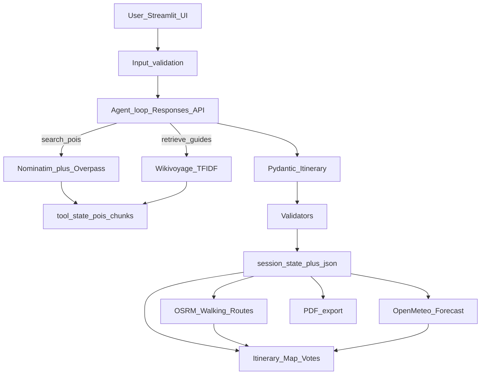

# Waypoint — AI Trip Planner Capstone

**Waypoint** is a production-style Streamlit app that plans multi-day city itineraries with an OpenAI **Responses API** agent, live **OpenStreetMap** points of interest, optional **Wikivoyage RAG**, an interactive **PyDeck** map, a city-scoped feedback loop, and **PDF/JSON export**.

**Repo:** [Mayank2504/waypoint-trip-planner](https://github.com/Mayank2504/waypoint-trip-planner)

**Live app:** [waypoint-trip-planner-mayank.streamlit.app](https://waypoint-trip-planner-mayank.streamlit.app/)

> Bring your own OpenAI API key. No keys are required for Nominatim, Overpass, or Wikivoyage.

## Screenshots


## What this demonstrates

| Skill | How it shows up |
| --- | --- |
| Agentic tool calling | Strict `search_pois` / `retrieve_guides` schemas on the Responses API |
| External data | Nominatim geocoding + Overpass POIs with retries and host fallbacks |
| RAG | Optional Wikivoyage fetch → TF-IDF + cosine similarity |
| Guardrails | Pydantic itinerary schema + `poi_id` validation + single-day regen check |
| UX | Day/block itinerary, PyDeck map, execution trace, Fast mode |
| Feedback loop | Up/down votes → ranking boosts for the same city |
| Persistence | Private Cloud session state + atomic local JSON autosave |
| Enrichment | OSRM walking routes + date-aligned Open-Meteo forecasts |
| Portfolio polish | PDF export, modular package layout, comprehensive pytest coverage |

## Architecture



## Features

- Destination, days, pace, interests, constraints
- Fast mode (default): one broad `search_pois` call for quicker plans
- Optional Wikivoyage RAG (off by default — public APIs may return 403)
- Day × Morning / Afternoon / Evening itinerary cards
- Map with day filter, colored markers, full temporal paths
- Policy-compliant OSRM walking geometry, leg times, distance, and graceful straight-line fallback
- Date-aware Open-Meteo daily forecasts that never block planning
- Refine whole trip or regenerate a single day (other days must stay unchanged)
- Upvote / downvote POIs; boosts feed the next search for that city
- Download `itinerary.json` and `itinerary.pdf`
- Sidebar API health checks (Nominatim / Overpass / Wikivoyage)
- Execution trace with timings

## Project layout

```text
app.py                 # Streamlit entry (UI wiring)
src/waypoint/          # Agent, OSM, RAG, validation, routing, weather, PDF
ui/                    # Sidebar, map, itinerary, health, trace
tests/                 # pytest
data/                  # Runtime state (gitignored JSON/JSONL)
assets/fonts/          # Optional DejaVuSans.ttf for PDF Unicode
requirements.txt
```

## Setup (local)

**Python 3.11** is recommended and used for release verification.

```bash
python3 -m venv .venv
source .venv/bin/activate          # Windows: .venv\Scripts\activate
pip install -r requirements.txt
streamlit run app.py
```

Optional: `export OPENAI_API_KEY=sk-...` so the sidebar picks up your key.

In the sidebar, set a **real contact email** for the OSM/Wikivoyage User-Agent.

### Tests

```bash
PYTHONPATH=src pytest -q -m "not live"
# Optional low-volume provider contract checks:
WAYPOINT_RUN_LIVE_TESTS=1 PYTHONPATH=src pytest -q -m live
```

The release suite currently contains 88 deterministic tests and enforces at least 85% combined backend/UI coverage. See [`TESTING.md`](TESTING.md) for the complete local, failure, isolation, and production-smoke matrix.

## API keys and costs

| Service | Key? | Notes |
| --- | --- | --- |
| OpenAI | Yes (BYO) | Default model `gpt-4.1-mini`. Typical plan ≈ $0.01–0.05. Set a usage cap. |
| Nominatim | No | [Usage policy](https://operations.osmfoundation.org/policies/nominatim/): 1 req/s, identifying User-Agent, cache results |
| Overpass | No | Retries + fallback hosts; backoff on 429 |
| Wikivoyage | No | May 403 without a proper User-Agent — leave RAG off |
| FOSSGIS OSRM | No | Walking routes; non-commercial reasonable use; maximum 1 request/second |
| Open-Meteo | No | Forecasts; free non-commercial limit 10,000 calls/day; attribution required |

**Never commit keys.** `.streamlit/secrets.toml` and `.env` are gitignored. For Streamlit Cloud, prefer BYO-key in the UI (no shared secret).

## How the agent works

1. User submits city / days / interests.
2. Agent loop (`client.responses.create`, `store=False`) may call:
   - `search_pois` → geocode + Overpass + feedback-aware ranking
   - `retrieve_guides` → Wikivoyage TF-IDF chunks (if RAG enabled)
3. Final JSON is validated with Pydantic and checked so every `poi_id` came from tools.
4. Validated itineraries are enriched with optional OSRM routes and Open-Meteo weather.
5. UI renders itinerary + map. Local votes use JSONL; Cloud votes remain private to the browser session.

**Feedback boosts:** `+0.25` per upvote, `-0.35` per downvote, scoped by `city_key`.

## Example output

A sanitized itinerary is checked in at [`examples/santa-fe-itinerary.json`](examples/santa-fe-itinerary.json).

Useful demonstrations:

- Food-and-outdoors weekend with routed walking legs
- Rain-aware day review using the daily forecast
- Single-day regeneration while every other day remains unchanged
- Feedback-driven POI reranking for a repeated local search

## Deploy (Streamlit Community Cloud)

**GitHub:** https://github.com/Mayank2504/waypoint-trip-planner

The app is live at [waypoint-trip-planner-mayank.streamlit.app](https://waypoint-trip-planner-mayank.streamlit.app/).

It deploys from `Mayank2504/waypoint-trip-planner`, branch `main`, entrypoint `app.py`.
Keep OpenAI as BYO-key; do not add a shared API key to Streamlit Secrets.

See [DEPLOY.md](DEPLOY.md) for more detail.

On Cloud, itineraries, votes, routes, weather, and keys are session-only. Local development can use atomic disk autosave.

## Troubleshooting

| Symptom | Fix |
| --- | --- |
| Nominatim / Wikivoyage 403 | Set a real User-Agent email; wait if rate-limited |
| Overpass timeout | Retry; Fast mode; smaller radius |
| Empty itinerary / unknown `poi_id` | Check execution trace; raise max steps |
| Map filter clears UI | Fixed: itinerary renders from session state outside the Generate button |
| PDF looks wrong for CJK names | Add `assets/fonts/DejaVuSans.ttf` or rely on system Unicode fonts |
| Walking route unavailable | The app safely falls back to straight map paths; retry later |
| Forecast unavailable | Confirm dates are within the next 16 days; itinerary generation still works |

## License

Use freely for learning and portfolio demos. Map data © [OpenStreetMap](https://www.openstreetmap.org/copyright) contributors.
